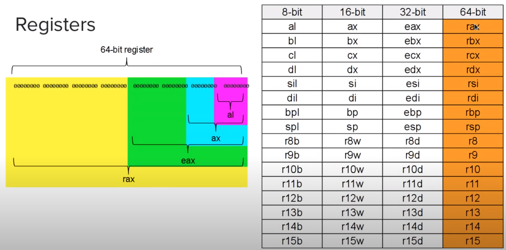

# Notes

```asm
section .data
    text db "Hello, World!", 10

section .text
    global _start

_start:
    mov rax, 1
    mov rdi, 1
    mov rsi, text
    mov rdx, 14
    syscall

    mov rax, 60
    mov rdi, 0
    syscall
```


`db` == define bytes, or "we're going to enter raw bytes here"

`text` in the `.data` section is defining a variable that can then be referenced by code within the `.text` section


<sub><sup>Image credit kupala: https://www.youtube.com/watch?v=BWRR3Hecjao</sup></sub>

## System Call Inputs by Register

| Argument | Registers |
| -------- | --------- |
| ID | rax |
| 1 | rdi |
| 2 | rsi |
| 3 | rdx |
| 4 | r10 |
| 5 | r8 |
| 6 | r9 |

Examples of syscalls: `sys_read`, `sys_write`, `sys_open`, `sys_close`, etc.


## Sections

`.data` - global variables

`.text` - code goes here

`.bss` - reserve memory to use

Labels are used to label a part of code (see `_start:` above)

The `_start` label is important... it is what the OS looks to run first in the program


## Jumps, Calls, Comparisons

### Flags

| Symbol | Description |
| ------ | ----------- |
| CF | Carry |
| PF | Parity |
| ZF | Zero |
| SF | Sign |
| OF | Overflow |
| AF | Adjust |
| IF | Interrupt Enabled |

### Pointers

Similar to pointers in other language. Standard pointers include `rip` (instruction pointer), `rsp` (stack pointer), and `rbp` (stack base pointer)

### Control Flow

Just like you expect

### Jumps

Jumps to different parts of the code based on labels

`jmp <label>`

Effectively, this just loads the address of `<label>` into the `rip` register

### Comparisons

compares register to another register, or value

Flags, most noteably `zf` is set as a result of the comparison. If the values are equal, `zf = 1`. If not, `zf = 0`

Conditional jumps occur immediately after a comparison

`je` equal, `jne` not equal, `jg`, 

### Registers as pointers

Surrounding a register name with `[` square brackets `]`, it uses the value it is pointing to

```assembly
mov rax, [rbx]
```

### Calls

Similar to a jump, but the original location can be returned to you using `ret`. See the following modification that now looks like a function call or subroutine

```asm
section .data
    text db "Hello, World!", 10

section .text
    global _start

_start:
    call _printHello

    mov rax, 60
    mov rdi, 0
    syscall

_printHello:
    mov rax, 1
    mov rdi, 1
    mov rsi, text
    mov rdx, 14
    syscall

```


## Getting User Input

See [`userinput.asm`](userinput.asm)

## Math Operations

Form: operation, register, value or register

First register is the _"subject"_ of the operation

> NOTE: `mul` and `div` _assume_ the subject is the `rax` register. 

| Operation | Signed | Description |
| --------- | ------ | ----------- |
| add a, b | | a = a+b |
| sub a, b | | a = a-b |
| mul reg | imul reg | rax = rax * reg |
| div reg | idiv reg | rax = rax / reg |
| neg reg | | reg = -reg |
| inc reg | | reg = reg + 1 |
| dec reg | | reg = reg - 1 |
| adc a, b | | a = a+b+CF |
| sbb a, b | | a = a-b-CF |


See [`math.asm`](math.asm)

Also has a simple example of pointers, using/moving/updating only part of a register, and mapping to ASCII.

### Stack

imagine it like a stack of papers... you can put anything on it, but at any given time, you can only see what is on the paper on top

push - add data to the top

pop - remove data from the top

'peeking' lets you look at the value with out touching it.

```asm
mov reg, [rsp]      ; simple peek
```

## Subroutine to Print Strings

See [`dynamicprinting.asm`](dynamicprinting.asm)

## Macros (specific to NASM)

See [`macros.asm`](macros.asm)

Also, note that `equ` allows you to define constants


```asm
STDIN equ 0
STDOUT equ 1
STDERR equ 2

SYS_READ equ 0
SYS_WRITE equ 1
SYS_EXIT = equ 60

section .data
    text db "Hello, World!", 10

section .text
    global _start

_start:
    mov rax, SYS_WRITE
    mov rdi, STDOUT
    mov rsi, text
    mov rdx, 14
    syscall

    mov rax, SYS_EXIT
    mov rdi, 0
    syscall
```

You can also include external files via the form:

```
%include "filename.asm"
```

Great way to grab constants, macros, subroutines, etc.

Check out [linux64.inc](http://pastebin.com/N1ZdmhLw)

NOTE: using `-g` in your `nasm` call will add the debug symbols, and allow GDB to step through them.

```bash
nasm -f elf64 -g myfile.asm -o myfile.o
ld myfile.o -o myfile
gdb myfile

(gdb) disassemble _start
```

> NOTE: I had been running along quite smoothly to this point, but then realized that I didn't quite understand everything that was going on in video #8, so I stopped to make sure I did. I also realized that I had sometime recently broken my installation of `pwndbg`, so I had to take some time to get that working.

The key point of confusion for me was the following line of code:

```asm
mov [digitSpacePos], rcx
```

Obviously, the brakets indicate the address, but does this mean it is copying the value contained in `rcx` to the 8-byte storage location pointed to by `digitSpacePos`? (likely, esp. now that I say it out loud). Well, there's nothing better than specific verification, so here we go...

Seeing that `digitSpace` was located at `0x402000`, it wasn't hard to guess (and have confirmed) that `digitSpacePos` was located at `0x402064`. Prior to line 29, it was all zeros.

It should also be instructive to look at the GDB disassembly which changed the line shown above to the following:

```asm
mov qword ptr [digitSpacePos], rcx <0x402064>
```

As suggested, after stepping through that line, a quick check of the contents of `digitSpacePos` (`(gdb) x /xg 0x402064`) showed a value of `0x0000000000402001`. This leaves us with the plain-text description of lines 2529 as the following:

1. Get the address of the start (1st byte) of `digitSpace` and store it in `rcx`
1. Store the line-feed character (`0xa`) in `rbx`
1. Copy the line-feed character to the location pointed to by `rcx`
1. Increment `rcx` by one
1. Stash/store the updated value of `rcx` (address pointing to the second byte within `digitSpace`) into `digitSpacePos`

With this established, the rest of the program logic falls into place (similar pattern, repeated). We proceed into the `_printRAXLoop` where we divide the number by `10`, grab the remainder, store it in `digitSpace` by using the address we stashed in `digitSpacePos` (the 2nd byte of `digitSpace`), increment `rcx`, store the updated value in `digitSpacePos` and continue.

_Essentially, `digitSpacePos` is an indexer into `digitSpace`. You might think we could just use the value stored in `rcx`, however we cannot assume that intermediate operations will leave that register alone, so we must preserve/restore it._

**Conclusion:** If I am understanding things at this point (likely not), any variables defined in the `.bss` section are essentially viewed as pointers/address locations (e.g. `char*`). If I want to read/update the contents, I need to _"dereference"_ the pointer using the `[]` notation. 


## Command Line Arguments (#9)

arguments are automatically placed on the stack! The top item on the stack is the number of arguments, followed by arg1 which is a pointer to a string holding the path of the executeable, followed by `arg[1]... arg[n]`

Check out [argtest.asm](argtest.asm)

NOTE: get latest [linux64.inc](http://pastebin.com/wCNZs3RN)

Look up author's file [argest.asm](http://pastebin.com/MAA0NFsK)

Consider the following:

```bash
$ ls
argtest  argtest.asm  argtest.o  dynamicprinting.asm  hello.asm  linux64.inc  macros.asm  math.asm  printints.asm  README.md  userinput.asm
$ ./argtest `ls`
???
```

## Introduction to Files (#10)

File Permissions

| Value | Read | Write | Execute |
|:-----:|:----:|:-----:|:-------:|
| 0 | | | |
| 1 | | | x |
| 2 | | x | |
| 3 | | x | x |
| 4 | x | | |
| 5 | x | | x |
| 6 | x | x | |
| 7 | x | x | x |

Also discusses the 4 least-significant octal values:

` special | owner | group | other`

Given this, a file with no special flags, the owner having R+W, and all others R, would be (in octal) `0644`

## Writing Files (#11)

Some simple but good stuff here

Check out [writing.asm](writing.asm)

## Reading Files (#12)

Check out [reading.asm](reading.asm)

## Pausing with Nanosleep (#13)

We've been using `db`, now we can use `dw`, `dd`, and `dq`

References [timespec](https://en.cppreference.com/w/c/chrono/timespec)

Check out [sleeping.asm](sleeping .asm)
